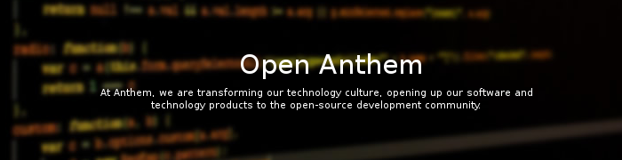

Anthem Portal (Demo) is open source software designed to deploy and manage enterprise applications as a highly availabile, platform neutral, highly scalable Software as a Services (SaaS).

Portal (Demo) is a turnkey solution that includes the entire 'stack" of features most organizations want within a SaaS.

For more information on Anthem Portal (Demo), please visit the [website](http://live-openanthem.pantheonsite.io)

## Who Uses Anthem Portal (Demo)?

* Presently no one, consider it a work in progress.

* See our [case studies](http://live-openanthem.pantheonsite.io/projects/)

* See out up-to-date list of current [contributors](https://github.com/openanthem/portal/wiki/Contributors)

* If are using Anthem Portal (Demo) in your organization and your company is not listed above, please complete our [survey.](https://github.com/openanthem/portal/wiki/Survey)

## Getting Started

### Getting Source Repository

* Anthem Project (Demo) uses Git.  The offical Git repository is at: [Here](https://github.com/opensourceanthem/mfp.git)
* Anthem Project (Demo) Login Module uses Git.  The offical Git repository is at: [Here](https://github.com/opensourceanthem/mfp-login.git)

### Links

* [Documentation](https://anthemopensource.atlassian.net/wiki/display/OA/Opensource+Project+Documentation)
* Developer [Knowledge Base](https://anthemopensource.atlassian.net/wiki/display/OA/Developer+Documentation)
* [Design Documentation](https://anthemopensource.atlassian.net/wiki/display/OA/Design+Documentation)
* How to [contribute](CONTRIBUTING.md)

### Getting Involved and Contributing

Interested in helping out with our project? Great! We welcome participation from anybody willing to work and make a contribution. Note that you do not have to be a developer in order to contribute. We need folks to help with documentation, translation, promotion etc.See our contribution page.

If you're interested in learning more or participating in the project, the [mailing lists](https://anthemopensource.atlassian.net/wiki/display/OA/Mailing+Lists) are the best way to do that. While the project has several communications channels, the mailing lists are the most active and the official channels for making decisions about the project itself.

Mailing lists:

* [Announcements Mailing List](mailto:anthem-opensource-portal@webteks.com)
* [Development Mailing List](mailto:anthem-opensource-portal@webteks.com)
* [Commits Mailing List](mailto:anthem-opensource-portal@webteks.com)
* [Issues Mailing List](mailto:anthem-opensource-portal@webteks.com)
* [Marketing Mailing List](mailto:anthem-opensource-portal@webteks.com)
* [Users Mailing List](mailto:anthem-opensource-portal@webteks.com)

SLACK, join us at https://anthemopensource.slack.com/signup

* #general - General Open Anthem conversation and end user support
* #dev - Development discussions

 
